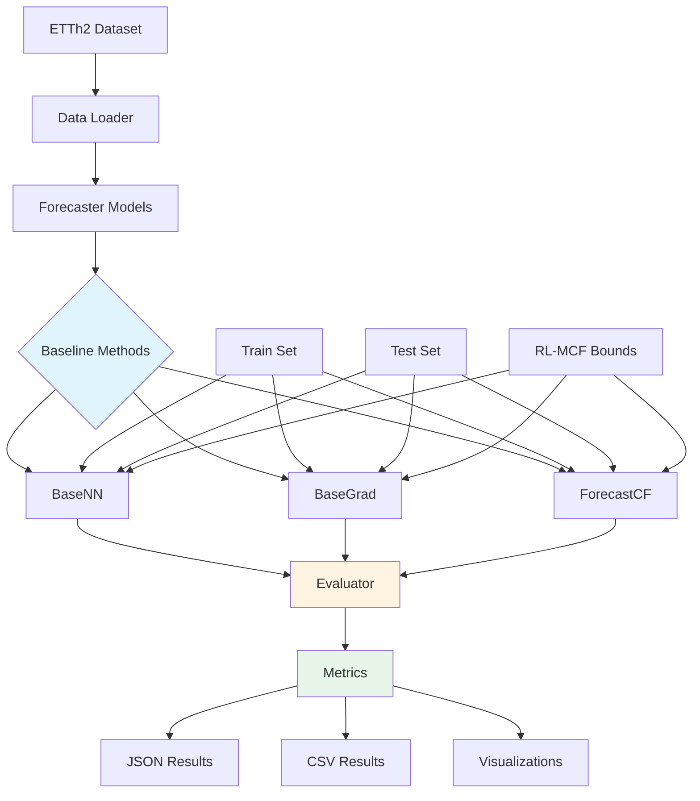
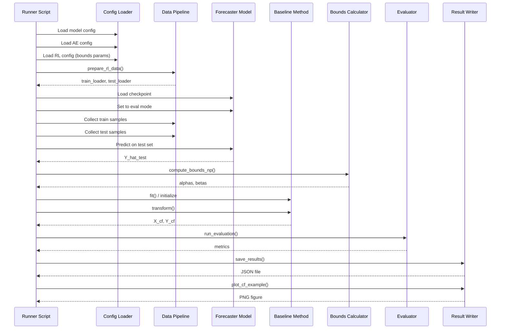

# Design Document: Baseline Extension for ETTh2 Dataset

## Overview

This feature extends the three baseline counterfactual explanation methods (BaseNN, BaseGrad, ForecastCF) to support the ETTh2 dataset with iTransformer and GRU models. The goal is to enable a complete comparison matrix across 4 methods × 2 datasets × 2 models, generating consistent evaluation metrics for research paper submission.

The extension leverages existing implementations for ETTh1 and adapts them to ETTh2 by creating new runner scripts, ensuring consistent hyperparameters (back_horizon=96, horizon=48, desired_change=-0.1), and maintaining the same evaluation pipeline used by the RLCF method.

## Architecture

### System Overview



### Component Interaction Flow



## Components and Interfaces

### Component 1: Runner Scripts

**Purpose**: Orchestrate the execution of baseline methods for specific dataset/model combinations

**Interface**:
```python
# Command-line interface
python baselines/{Method}/run_{method}.py \
    --dataset {etth1|etth2|weather} \
    --model {gru|itransformer|patchtst|dlinear|timesnet} \
    --seeds 1 9 30 \
    --device {cpu|cuda} \
    --n_batches 20 \
    --output_dir baselines/{Method}/results
```

**Responsibilities**:
- Parse command-line arguments
- Load configuration files (forecaster, AE, RL bounds)
- Initialize forecaster model with checkpoint
- Prepare data loaders for train/test sets
- Execute baseline method across multiple seeds
- Aggregate results and save outputs
- Generate visualizations

**Existing Implementations**:
- `baselines/BaseNN/run_basenn.py` (ETTh1: iTransformer, GRU)
- `baselines/BaseGrad/run_basegrad.py` (ETTh1: iTransformer)
- `baselines/ForecastCF/run_etth1_gru.py` (ETTh1: GRU)
- `baselines/ForecastCF/run_etth1_itransformer.sh` (ETTh1: iTransformer)

**New Scripts Required**:
- `baselines/BaseNN/run_basenn_etth2.py` (ETTh2: iTransformer, GRU)
- `baselines/BaseGrad/run_basegrad_etth2.py` (ETTh2: iTransformer, GRU)
- `baselines/ForecastCF/run_etth2_gru.py` (ETTh2: GRU)
- `baselines/ForecastCF/run_etth2_itransformer.py` (ETTh2: iTransformer)

### Component 2: Baseline Methods

**Purpose**: Generate counterfactual explanations using different strategies

#### BaseNN (Nearest Neighbor)

**Interface**:
```python
class BaseNN:
    def fit(self, X_train: np.ndarray, Y_hat_train: np.ndarray) -> None
    def transform(self, X_test: np.ndarray, alphas: np.ndarray, betas: np.ndarray) -> Tuple[np.ndarray, np.ndarray]
```

**Algorithm**:
1. Store training set forecasts
2. For each test sample, compute target = (alpha + beta) / 2
3. Find nearest neighbor in training forecasts using L2 distance
4. Return corresponding training input as counterfactual

**Status**: ✅ Implemented for ETTh1 (iTransformer, GRU)

#### BaseGrad (Gradient Descent)

**Interface**:
```python
class BaseGrad:
    def __init__(self, forecaster, device, lr=0.01, max_iter=300, w_validity=1.0, w_proximity=0.5)
    def transform(self, X_np: np.ndarray, alphas: np.ndarray, betas: np.ndarray, 
                  X_full: torch.Tensor, X_mark: torch.Tensor) -> Tuple[np.ndarray, np.ndarray]
```

**Algorithm**:
1. Initialize x_cf = x_orig
2. For max_iter iterations:
   - Compute y_cf = forecaster(x_cf)
   - Compute L_validity = mean(relu(α - y_cf) + relu(y_cf - β))
   - Compute L_proximity = mean(|x_cf - x_orig|)
   - Compute L = w_v * L_validity + w_p * L_proximity
   - Update x_cf using SPSA gradient approximation with Adam
   - Clip x_cf to [x_min - 3σ, x_max + 3σ]
3. Return final x_cf

**Status**: ✅ Implemented for ETTh1 (iTransformer)

#### ForecastCF (Masked Gradient Optimization)

**Interface**:
```python
class ForecastCF:
    def __init__(self, max_iter=300, optimizer, pred_margin_weight=0.5, 
                 step_weights, random_state)
    def fit(self, model) -> None
    def transform(self, X_test, desired_max_lst, desired_min_lst) -> Tuple[np.ndarray, np.ndarray, np.ndarray]
```

**Algorithm**:
1. Initialize x_cf = x_orig
2. For max_iter iterations:
   - Compute y_cf = forecaster(x_cf)
   - Identify timesteps where y_cf is outside [α, β]
   - Apply temporal mask to focus optimization on violating timesteps
   - Compute weighted loss with validity and proximity terms
   - Gradient descent update
3. Return final x_cf

**Status**: ✅ Implemented for ETTh1 (iTransformer, GRU) via PyTorch adapter

### Component 3: Bounds Calculator

**Purpose**: Compute target bounds [α, β] using RL-MCF methodology

**Interface**:
```python
def compute_bounds_np(
    x_ot: np.ndarray,      # [N, BH, 1]
    y_hat: np.ndarray,     # [N, H, 1]
    rho: float,            # Offset from forecast
    fr: float,             # Bound width factor
    direction: str,        # 'decrease' or 'increase'
    global_sigma: float    # Global std of training data
) -> Tuple[np.ndarray, np.ndarray]:  # alphas [N, H], betas [N, H]
```

**Algorithm**:
```
For each sample i:
    β_i = ŷ_i - ρ · σ_global
    α_i = β_i - fr · σ_global
    
    # Ensure ŷ_i ∉ [α_i, β_i] by construction
```

**Responsibilities**:
- Load bounds parameters from RL config files
- Compute forecast-anchored bounds
- Ensure non-trivial counterfactual objective

**Status**: ✅ Implemented in `baselines/common/bounds.py`

### Component 4: Evaluator

**Purpose**: Compute standardized metrics for counterfactual quality

**Interface**:
```python
def run_evaluation(
    x_orig: np.ndarray,
    x_cf: np.ndarray,
    y_hat: np.ndarray,
    y_cf: np.ndarray,
    alphas: np.ndarray,
    betas: np.ndarray,
    x_train: np.ndarray,
    method_name: str,
    seed: int
) -> dict
```

**Metrics Computed**:
1. **Validity Ratio**: Fraction of samples where all forecast timesteps fall within [α, β]
2. **Stepwise AUC**: Area under cumulative validity curve across forecast horizon
3. **Proximity L2**: L2 distance between original and counterfactual inputs
4. **Compactness**: Fraction of timesteps modified (non-zero perturbation)
5. **Temporal Consistency**: Smoothness of perturbations (gradient variance)
6. **Plausibility**: Distance to nearest training sample

**Status**: ✅ Implemented in `baselines/common/evaluator_wrapper.py`

### Component 5: Configuration System

**Purpose**: Manage model, dataset, and experiment configurations

**Configuration Files Required**:

#### Forecaster Configs
- `assets/configs/models/etth2_dataset/forecasters/gru/etth2_96_48_S.json`
- `assets/configs/models/etth2_dataset/forecasters/itransformer/etth2_96_48_S.json`

#### AE Config
- `assets/configs/models/etth2_dataset/ae/tcn_ae.json`

#### RL Configs (for bounds parameters)
- `assets/configs/models/etth2_dataset/RL/config_gru.json`
- `assets/configs/models/etth2_dataset/RL/config_itransformer.json`

**Config Structure**:
```json
{
  "model_name": "iTransformer",
  "dataset_name": "ETTh2",
  "seq_len": 96,
  "pred_len": 48,
  "checkpoint_dir": "assets/checkpoints/etth2_chpts/forecaster",
  "checkpoint_name": "chpt_etth2_96_48_S.pth",
  "rho": 0.5,
  "fr": 1.0,
  "direction": "decrease",
  "global_sigma": 0.8
}
```

**Status**: 
- ✅ ETTh2 forecaster configs exist
- ✅ ETTh2 AE config exists
- ✅ ETTh2 RL configs exist

### Component 6: Data Pipeline

**Purpose**: Load and preprocess time series data for baseline methods

**Interface**:
```python
def prepare_rl_data(
    cfg_f: Config,
    cfg_ae: Config,
    device: torch.device
) -> Tuple[DataLoader, DataLoader, dict]
```

**Responsibilities**:
- Load ETTh2.csv dataset
- Split into train/test sets (80/20)
- Normalize using train statistics
- Create sliding window sequences (seq_len=96, pred_len=48)
- Return PyTorch DataLoaders

**Status**: ✅ Implemented in `src/training/RL_trainers/trainer_last.py`

### Component 7: Result I/O

**Purpose**: Save and aggregate experimental results

**Interface**:
```python
def save_results(result_dict: dict, output_path: str) -> None
def aggregate_seeds(seed_results: List[dict]) -> dict
def build_result_dict(method: str, dataset: str, model: str, ...) -> dict
```

**Output Formats**:

#### JSON Format (per method/dataset/model)
```json
{
  "method": "BaseNN",
  "dataset": "etth2",
  "model": "gru",
  "n_samples": 640,
  "runtime_seconds": 12.5,
  "metrics": {
    "validity_ratio": {"mean": 0.75, "std": 0.03},
    "stepwise_auc": {"mean": 0.68, "std": 0.02},
    "proximity_l2": {"mean": 2.1, "std": 0.1},
    "compactness": {"mean": 0.35, "std": 0.02},
    "temporal_consistency": {"mean": 0.92, "std": 0.01}
  },
  "seeds": [1, 9, 30],
  "bounds_params": {
    "rho": 0.5,
    "fr": 1.0,
    "direction": "decrease"
  }
}
```

#### CSV Format (for LaTeX table generation)
```csv
dataset,method,model,validity_ratio,stepwise_auc,proximity_l2,compactness,temporal_consistency
etth2,BaseNN,gru,0.75±0.03,0.68±0.02,2.1±0.1,0.35±0.02,0.92±0.01
etth2,BaseNN,itransformer,0.78±0.02,0.71±0.03,1.9±0.1,0.32±0.03,0.94±0.01
```

**Status**: ✅ Implemented in `baselines/common/result_io.py`

## Data Models

### Input Data

```python
# Time series input (OT channel only)
X: np.ndarray  # Shape: [N, back_horizon, 1]
               # N = number of samples
               # back_horizon = 96 (lookback window)
               # 1 = univariate (OT channel)

# Full multivariate input (for forecaster)
X_full: torch.Tensor  # Shape: [N, seq_len, n_features]
                      # seq_len = 96
                      # n_features = 7 (HUFL, HULL, MUFL, MULL, LUFL, LULL, OT)

# Time features
X_mark: torch.Tensor  # Shape: [N, seq_len, time_features]
                      # time_features = 4 (month, day, weekday, hour)
```

### Forecast Data

```python
# Original forecasts
Y_hat: np.ndarray  # Shape: [N, horizon, 1]
                   # horizon = 48 (forecast length)

# Counterfactual forecasts
Y_cf: np.ndarray   # Shape: [N, horizon, 1]
```

### Bounds Data

```python
# Target bounds (RL-MCF methodology)
alphas: np.ndarray  # Shape: [N, horizon]
                    # Lower bounds: β - fr·σ

betas: np.ndarray   # Shape: [N, horizon]
                    # Upper bounds: ŷ - ρ·σ
```

### Counterfactual Data

```python
# Counterfactual inputs
X_cf: np.ndarray  # Shape: [N, back_horizon, 1]
                  # Modified input sequences
```

## Error Handling

### Error Scenario 1: Missing Checkpoint

**Condition**: Forecaster checkpoint file not found for ETTh2/model combination
**Response**: Raise FileNotFoundError with clear message indicating missing checkpoint path
**Recovery**: User must train forecaster model first using `src/experiments/forecasting/run.py`

### Error Scenario 2: Missing Configuration

**Condition**: Config file (forecaster, AE, or RL) not found
**Response**: Raise FileNotFoundError with path to missing config
**Recovery**: User must create config file or verify dataset/model names

### Error Scenario 3: Incompatible Checkpoint

**Condition**: Checkpoint architecture mismatch with config
**Response**: Catch RuntimeError during model.load_state_dict(), log error with checkpoint path
**Recovery**: Verify checkpoint corresponds to correct model architecture

### Error Scenario 4: CUDA Out of Memory

**Condition**: GPU memory exhausted during batch processing
**Response**: Catch torch.cuda.OutOfMemoryError, suggest reducing n_batches or using CPU
**Recovery**: Automatically fall back to CPU device or reduce batch size

### Error Scenario 5: Invalid Bounds

**Condition**: Computed bounds result in α > β or NaN values
**Response**: Log warning with sample indices, skip invalid samples
**Recovery**: Filter out invalid samples before evaluation

### Error Scenario 6: Optimization Failure (BaseGrad/ForecastCF)

**Condition**: Gradient descent fails to converge after max_iter
**Response**: Log warning, return best x_cf found so far
**Recovery**: Continue with remaining samples, report convergence rate in results

## Testing Strategy

### Unit Testing Approach

**Test Coverage**:
1. **Bounds Calculation**: Verify compute_bounds_np() produces valid [α, β] intervals
2. **Data Loading**: Test prepare_rl_data() returns correct shapes and normalization
3. **Baseline Methods**: Test each method's transform() with synthetic data
4. **Metrics**: Verify evaluator computes correct validity, proximity, compactness
5. **Result I/O**: Test JSON/CSV serialization and aggregation

**Test Framework**: pytest

**Key Test Cases**:
```python
def test_compute_bounds_valid():
    # Verify α < β for all samples
    # Verify ŷ ∉ [α, β] by construction

def test_basenn_nearest_neighbor():
    # Verify NN selection minimizes distance to target

def test_basegrad_convergence():
    # Verify loss decreases over iterations

def test_forecastcf_masking():
    # Verify only violating timesteps are optimized

def test_evaluator_metrics():
    # Verify validity_ratio = 1.0 when all forecasts in bounds
    # Verify proximity_l2 = 0.0 when x_cf = x_orig
```

### Integration Testing Approach

**Test Scenarios**:
1. **End-to-End Pipeline**: Run complete baseline on small ETTh2 subset (10 samples)
2. **Cross-Dataset Consistency**: Verify same hyperparameters work for ETTh1 and ETTh2
3. **Multi-Seed Reproducibility**: Verify results are reproducible with fixed seeds
4. **Result Aggregation**: Verify mean/std computed correctly across seeds

**Test Data**: Use first 100 samples from ETTh2 test set

**Validation Criteria**:
- All metrics in valid ranges (validity ∈ [0,1], proximity > 0)
- Runtime < 5 minutes for 100 samples
- JSON output parseable and contains all required fields
- Visualizations generated without errors

## Performance Considerations

### Computational Complexity

**BaseNN**:
- Time: O(N × M × H) where N=test samples, M=train samples, H=horizon
- Space: O(M × BH) for storing training set
- Fastest method (~10ms per sample)

**BaseGrad**:
- Time: O(N × max_iter × H) for gradient descent
- Space: O(N × BH) for batch processing
- Medium speed (~500ms per sample with max_iter=300)

**ForecastCF**:
- Time: O(N × max_iter × H) with masking optimization
- Space: O(N × BH) for batch processing
- Slowest method (~800ms per sample with max_iter=300)

### Optimization Strategies

1. **Batch Processing**: Process test samples in batches of 32 to leverage GPU parallelism
2. **Early Stopping**: Terminate gradient descent when validity loss < 1e-4
3. **Train Set Sampling**: Limit BaseNN training set to 1000 samples for faster NN search
4. **Caching**: Skip re-computation if results already exist (check_cache())

### Resource Requirements

**Memory**:
- Train set: ~50MB (8000 samples × 96 timesteps × 7 features × 4 bytes)
- Test set: ~10MB (1600 samples × 96 timesteps × 7 features × 4 bytes)
- Model: ~50MB (iTransformer) or ~10MB (GRU)
- Total: ~120MB per experiment

**Compute Time** (estimated for 640 test samples):
- BaseNN: ~10 seconds
- BaseGrad: ~5 minutes
- ForecastCF: ~8 minutes
- Total per dataset/model: ~15 minutes
- Total for all experiments: 4 methods × 2 datasets × 2 models × 15 min = **2 hours**

## Security Considerations

### Data Privacy

**Concern**: ETTh2 dataset contains electricity transformer temperature readings
**Mitigation**: Data is publicly available (ETT benchmark), no privacy concerns

### Model Checkpoints

**Concern**: Loading untrusted checkpoint files could execute malicious code
**Mitigation**: 
- Use torch.load() with weights_only=True (PyTorch 2.0+)
- Verify checkpoint paths are within project directory
- Log checkpoint SHA256 hash in results for reproducibility

### File System Access

**Concern**: Runner scripts write to file system (results, figures)
**Mitigation**:
- Restrict output paths to baselines/ directory
- Validate output_dir argument to prevent path traversal
- Use os.path.abspath() to resolve paths safely

## Dependencies

### Python Packages

**Core Dependencies**:
- torch >= 2.0.0 (PyTorch for models)
- numpy >= 1.24.0 (numerical operations)
- pandas >= 2.0.0 (data loading)
- matplotlib >= 3.7.0 (visualizations)
- scikit-learn >= 1.3.0 (metrics)

**Baseline-Specific**:
- tensorflow >= 2.13.0 (ForecastCF optimizer compatibility)

### Model Checkpoints

**Required Checkpoints**:
- `assets/checkpoints/etth2_chpts/forecaster/chpt_etth2_96_48_gru_S.pth`
- `assets/checkpoints/etth2_chpts/forecaster/chpt_etth2_96_48_S.pth` (iTransformer)
- `assets/checkpoints/etth2_chpts/ae/ae_etth2.pt`

**Status**: ✅ All checkpoints exist (verified from file tree)

### Configuration Files

**Required Configs**:
- `assets/configs/models/etth2_dataset/forecasters/gru/etth2_96_48_S.json`
- `assets/configs/models/etth2_dataset/forecasters/itransformer/etth2_96_48_S.json`
- `assets/configs/models/etth2_dataset/ae/tcn_ae.json`
- `assets/configs/models/etth2_dataset/RL/config_gru.json`
- `assets/configs/models/etth2_dataset/RL/config_itransformer.json`

**Status**: ✅ All configs exist (verified from file tree)

### External Services

**None**: All computation is local, no external API calls required

## Implementation Plan

### Phase 1: Verify Existing Implementations (Day 1, Morning)

1. ✅ Verify BaseNN works for ETTh1/iTransformer and ETTh1/GRU
2. ✅ Verify BaseGrad works for ETTh1/iTransformer
3. ⚠️ Extend BaseGrad to ETTh1/GRU (currently missing)
4. ✅ Verify ForecastCF works for ETTh1/iTransformer and ETTh1/GRU

### Phase 2: Create ETTh2 Runner Scripts (Day 1, Afternoon)

1. Create `baselines/BaseNN/run_basenn_etth2.py`
2. Create `baselines/BaseGrad/run_basegrad_etth2.py`
3. Create `baselines/ForecastCF/run_etth2_gru.py`
4. Create `baselines/ForecastCF/run_etth2_itransformer.py`

### Phase 3: Execute Experiments (Day 2, Morning)

1. Run BaseNN for ETTh2/iTransformer and ETTh2/GRU
2. Run BaseGrad for ETTh2/iTransformer and ETTh2/GRU
3. Run ForecastCF for ETTh2/iTransformer and ETTh2/GRU

### Phase 4: Aggregate Results (Day 2, Afternoon)

1. Collect all JSON results
2. Generate comparison CSV for LaTeX table
3. Verify all metrics are consistent
4. Generate visualizations for paper

## Correctness Properties

### Property 1: Bounds Validity

**Statement**: For all samples i and all timesteps t, α_i,t < β_i,t

**Verification**: Unit test with synthetic data

### Property 2: Forecast Exclusion

**Statement**: For all samples i, ∃t such that ŷ_i,t ∉ [α_i,t, β_i,t]

**Verification**: Assert in compute_bounds_np()

### Property 3: Metric Ranges

**Statement**: 
- validity_ratio ∈ [0, 1]
- stepwise_auc ∈ [0, 1]
- proximity_l2 ≥ 0
- compactness ∈ [0, 1]
- temporal_consistency ∈ [0, 1]

**Verification**: Assert in run_evaluation()

### Property 4: Reproducibility

**Statement**: For fixed seed s, running the same baseline twice produces identical results

**Verification**: Integration test with seed=42

### Property 5: Cross-Dataset Consistency

**Statement**: Same hyperparameters produce comparable metrics for ETTh1 and ETTh2

**Verification**: Compare validity_ratio ranges across datasets (should be within 0.2)

## Completion Criteria

### Functional Requirements

- [ ] All 3 baseline methods run successfully on ETTh2 with iTransformer
- [ ] All 3 baseline methods run successfully on ETTh2 with GRU
- [ ] Results saved in JSON format with all required metrics
- [ ] Results saved in CSV format compatible with LaTeX table generation
- [ ] Visualizations generated for sample counterfactuals

### Quality Requirements

- [ ] Validity ratio > 0.5 for all methods (indicates bounds are achievable)
- [ ] Proximity L2 < 5.0 for all methods (indicates reasonable perturbations)
- [ ] Runtime < 10 minutes per method/dataset/model combination
- [ ] All metrics have std < 0.1 across seeds (indicates stability)

### Documentation Requirements

- [ ] README updated with ETTh2 experiment instructions
- [ ] Results table generated for paper
- [ ] Comparison with RLCF results documented
