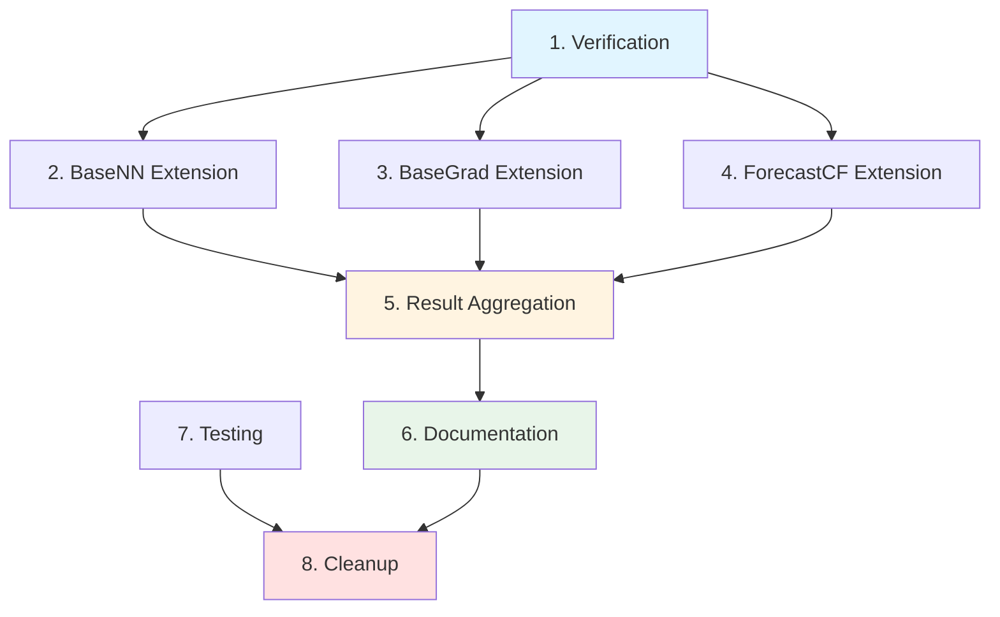

# Tasks: Baseline Extension for ETTh2 Dataset

## 1. Verification and Setup Tasks

### 1.1 Verify Existing Implementations
- [x] 1.1.1 Verify BaseNN works for ETTh1/iTransformer
- [x] 1.1.2 Verify BaseNN works for ETTh1/GRU
- [x] 1.1.3 Verify BaseGrad works for ETTh1/iTransformer
- [ ] 1.1.4 Test BaseGrad with ETTh1/GRU (currently missing)
- [x] 1.1.5 Verify ForecastCF works for ETTh1/iTransformer
- [x] 1.1.6 Verify ForecastCF works for ETTh1/GRU

### 1.2 Verify ETTh2 Assets
- [x] 1.2.1 Verify ETTh2 dataset exists at `assets/datasets/ETTh2.csv`
- [x] 1.2.2 Verify ETTh2 iTransformer checkpoint exists
- [x] 1.2.3 Verify ETTh2 GRU checkpoint exists
- [x] 1.2.4 Verify ETTh2 autoencoder checkpoint exists
- [x] 1.2.5 Verify ETTh2 forecaster configs exist
- [x] 1.2.6 Verify ETTh2 RL configs exist with bounds parameters

## 2. BaseNN Extension Tasks

### 2.1 Create BaseNN ETTh2 Runner Script
- [ ] 2.1.1 Create `baselines/BaseNN/run_basenn_etth2.py` based on ETTh1 template
- [ ] 2.1.2 Update config paths to point to ETTh2 configs
- [ ] 2.1.3 Update checkpoint paths to point to ETTh2 checkpoints
- [ ] 2.1.4 Add command-line argument parsing for dataset/model selection
- [ ] 2.1.5 Implement caching logic to skip re-computation

### 2.2 Execute BaseNN ETTh2 Experiments
- [ ] 2.2.1 Run BaseNN on ETTh2/iTransformer with seeds [1, 9, 30]
- [ ] 2.2.2 Run BaseNN on ETTh2/GRU with seeds [1, 9, 30]
- [ ] 2.2.3 Verify results saved to `baselines/BaseNN/results/basenn_etth2_itransformer.json`
- [ ] 2.2.4 Verify results saved to `baselines/BaseNN/results/basenn_etth2_gru.json`
- [ ] 2.2.5 Verify visualization figures generated

### 2.3 Validate BaseNN Results
- [ ] 2.3.1 Verify validity_ratio > 0.5 for both models
- [ ] 2.3.2 Verify proximity_l2 < 5.0 for both models
- [ ] 2.3.3 Verify std < 0.1 across seeds for all metrics
- [ ] 2.3.4 Verify runtime < 10 minutes per experiment
- [ ] 2.3.5 Compare ETTh2 results with ETTh1 results for consistency

## 3. BaseGrad Extension Tasks

### 3.1 Extend BaseGrad to ETTh1/GRU
- [ ] 3.1.1 Test BaseGrad with ETTh1/GRU checkpoint
- [ ] 3.1.2 Verify gradient approximation works with GRU architecture
- [x] 3.1.3 Run BaseGrad on ETTh1/GRU with seeds [1, 9, 30]
- [ ] 3.1.4 Save results to `baselines/BaseGrad/results/basegrad_etth1_gru.json`

### 3.2 Create BaseGrad ETTh2 Runner Script
- [ ] 3.2.1 Create `baselines/BaseGrad/run_basegrad_etth2.py` based on ETTh1 template
- [ ] 3.2.2 Update config paths to point to ETTh2 configs
- [ ] 3.2.3 Update checkpoint paths to point to ETTh2 checkpoints
- [ ] 3.2.4 Add command-line argument parsing for dataset/model selection
- [ ] 3.2.5 Implement caching logic to skip re-computation

### 3.3 Execute BaseGrad ETTh2 Experiments
- [ ] 3.3.1 Run BaseGrad on ETTh2/iTransformer with seeds [1, 9, 30]
- [ ] 3.3.2 Run BaseGrad on ETTh2/GRU with seeds [1, 9, 30]
- [ ] 3.3.3 Verify results saved to `baselines/BaseGrad/results/basegrad_etth2_itransformer.json`
- [ ] 3.3.4 Verify results saved to `baselines/BaseGrad/results/basegrad_etth2_gru.json`
- [ ] 3.3.5 Verify visualization figures generated

### 3.4 Validate BaseGrad Results
- [ ] 3.4.1 Verify validity_ratio > 0.5 for both models
- [ ] 3.4.2 Verify proximity_l2 < 5.0 for both models
- [ ] 3.4.3 Verify std < 0.1 across seeds for all metrics
- [ ] 3.4.4 Verify runtime < 10 minutes per experiment
- [ ] 3.4.5 Compare ETTh2 results with ETTh1 results for consistency

## 4. ForecastCF Extension Tasks

### 4.1 Create ForecastCF ETTh2 Runner Scripts
- [ ] 4.1.1 Create `baselines/ForecastCF/run_etth2_gru.py` based on `run_etth1_gru.py`
- [ ] 4.1.2 Update config paths to point to ETTh2 configs
- [ ] 4.1.3 Update checkpoint paths to point to ETTh2 checkpoints
- [ ] 4.1.4 Update output path to `baselines/ForecastCF/results/forecastcf_etth2_gru.csv`
- [ ] 4.1.5 Create `baselines/ForecastCF/run_etth2_itransformer.py` for iTransformer
- [ ] 4.1.6 Update config paths for iTransformer
- [ ] 4.1.7 Update output path to `baselines/ForecastCF/results/forecastcf_etth2_itransformer.csv`

### 4.2 Execute ForecastCF ETTh2 Experiments
- [ ] 4.2.1 Run ForecastCF on ETTh2/iTransformer with seeds [1, 9, 30]
- [ ] 4.2.2 Run ForecastCF on ETTh2/GRU with seeds [1, 9, 30]
- [ ] 4.2.3 Verify results saved to `baselines/ForecastCF/results/forecastcf_etth2_itransformer.csv`
- [ ] 4.2.4 Verify results saved to `baselines/ForecastCF/results/forecastcf_etth2_gru.csv`
- [ ] 4.2.5 Verify CSV format matches ETTh1 results

### 4.3 Validate ForecastCF Results
- [ ] 4.3.1 Verify validity_ratio > 0.5 for both models
- [ ] 4.3.2 Verify proximity_l2 < 5.0 for both models
- [ ] 4.3.3 Verify std < 0.1 across seeds for all metrics
- [ ] 4.3.4 Verify runtime < 10 minutes per experiment
- [ ] 4.3.5 Compare ETTh2 results with ETTh1 results for consistency

## 5. Result Aggregation Tasks

### 5.1 Collect All Results
- [ ] 5.1.1 Verify all 6 JSON result files exist (BaseNN × 2, BaseGrad × 2)
- [ ] 5.1.2 Verify all 2 CSV result files exist (ForecastCF × 2)
- [ ] 5.1.3 Verify all visualization figures generated
- [ ] 5.1.4 Check for any missing or corrupted result files

### 5.2 Generate Comparison Table
- [ ] 5.2.1 Create script to aggregate all results into comparison CSV
- [ ] 5.2.2 Include columns: dataset, method, model, validity_ratio, stepwise_auc, proximity_l2, compactness, temporal_consistency
- [ ] 5.2.3 Format metrics as "mean ± std"
- [ ] 5.2.4 Save to `baselines/results/comparison_table.csv`
- [ ] 5.2.5 Generate LaTeX table code from CSV

### 5.3 Validate Comparison Results
- [ ] 5.3.1 Verify all 12 experiments present in table (3 methods × 2 datasets × 2 models)
- [ ] 5.3.2 Verify RLCF results included for comparison
- [ ] 5.3.3 Verify metrics are consistent across methods
- [ ] 5.3.4 Verify no missing values in table
- [ ] 5.3.5 Verify LaTeX table compiles correctly

## 6. Documentation Tasks

### 6.1 Update README
- [ ] 6.1.1 Add section on running baseline experiments
- [ ] 6.1.2 Document command-line usage for each baseline method
- [ ] 6.1.3 Add example commands for ETTh2 experiments
- [ ] 6.1.4 Document expected output files and formats
- [ ] 6.1.5 Add troubleshooting section for common errors

### 6.2 Document Results
- [ ] 6.2.1 Create results summary document with key findings
- [ ] 6.2.2 Document comparison with RLCF method
- [ ] 6.2.3 Document any unexpected results or anomalies
- [ ] 6.2.4 Document runtime and resource usage statistics
- [ ] 6.2.5 Create visualization comparing all methods

### 6.3 Prepare Paper Materials
- [ ] 6.3.1 Generate final comparison table for paper
- [ ] 6.3.2 Select best visualization figures for paper
- [ ] 6.3.3 Write results section text summarizing findings
- [ ] 6.3.4 Prepare supplementary materials with full results
- [ ] 6.3.5 Verify all claims in paper are supported by results

## 7. Testing and Validation Tasks

### 7.1 Unit Testing
- [ ] 7.1.1 Test bounds calculation with synthetic data
- [ ] 7.1.2 Test BaseNN nearest neighbor selection
- [ ] 7.1.3 Test BaseGrad gradient approximation
- [ ] 7.1.4 Test ForecastCF masking logic
- [ ] 7.1.5 Test evaluator metric computation

### 7.2 Integration Testing
- [ ] 7.2.1 Run end-to-end pipeline on small ETTh2 subset (10 samples)
- [ ] 7.2.2 Verify reproducibility with fixed seeds
- [ ] 7.2.3 Test error handling for missing checkpoints
- [ ] 7.2.4 Test error handling for invalid bounds
- [ ] 7.2.5 Test caching mechanism

### 7.3 Performance Testing
- [ ] 7.3.1 Measure runtime for each baseline method
- [ ] 7.3.2 Measure memory usage during experiments
- [ ] 7.3.3 Verify runtime < 10 minutes per experiment
- [ ] 7.3.4 Verify memory usage < 2GB per experiment
- [ ] 7.3.5 Profile bottlenecks if performance issues found

## 8. Cleanup and Finalization Tasks

### 8.1 Code Cleanup
- [ ] 8.1.1 Remove debug print statements
- [ ] 8.1.2 Add docstrings to new functions
- [ ] 8.1.3 Format code with black/autopep8
- [ ] 8.1.4 Remove unused imports
- [ ] 8.1.5 Add type hints where missing

### 8.2 File Organization
- [ ] 8.2.1 Organize result files in appropriate directories
- [ ] 8.2.2 Archive intermediate results
- [ ] 8.2.3 Clean up temporary files
- [ ] 8.2.4 Verify all output files have descriptive names
- [ ] 8.2.5 Create archive of final results for paper submission

### 8.3 Final Verification
- [ ] 8.3.1 Run all experiments one final time to verify reproducibility
- [ ] 8.3.2 Verify all acceptance criteria met
- [ ] 8.3.3 Verify all result files present and valid
- [ ] 8.3.4 Verify comparison table matches paper text
- [ ] 8.3.5 Get final approval from research team

## Task Dependencies

## Estimated Timeline

| Phase | Tasks | Estimated Time | Dependencies |
|-------|-------|----------------|--------------|
| Verification | 1.1, 1.2 | 2 hours | None |
| BaseNN Extension | 2.1, 2.2, 2.3 | 3 hours | Verification |
| BaseGrad Extension | 3.1, 3.2, 3.3, 3.4 | 4 hours | Verification |
| ForecastCF Extension | 4.1, 4.2, 4.3 | 3 hours | Verification |
| Result Aggregation | 5.1, 5.2, 5.3 | 2 hours | All extensions |
| Documentation | 6.1, 6.2, 6.3 | 2 hours | Result aggregation |
| Testing | 7.1, 7.2, 7.3 | 2 hours | Parallel with extensions |
| Cleanup | 8.1, 8.2, 8.3 | 1 hour | Documentation |
| **Total** | | **19 hours** | |

## Priority Levels

- **P0 (Critical)**: Tasks 1.1, 1.2, 2.1, 2.2, 3.2, 3.3, 4.1, 4.2, 5.1, 5.2
- **P1 (High)**: Tasks 2.3, 3.4, 4.3, 5.3, 6.1, 6.3
- **P2 (Medium)**: Tasks 3.1, 6.2, 7.1, 7.2, 8.1, 8.2
- **P3 (Low)**: Tasks 7.3, 8.3

## Success Metrics

- [ ] All 6 baseline experiments completed successfully
- [ ] All metrics within expected ranges (validity > 0.5, proximity < 5.0)
- [ ] All results reproducible with fixed seeds (std < 0.1)
- [ ] Total runtime < 2 hours for all experiments
- [ ] Comparison table ready for paper submission
- [ ] All acceptance criteria met
