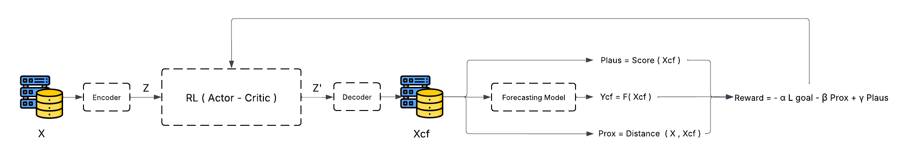

# Counterfactual Explanations for Time Series Forecasting via Multi-Objective Reinforcement Learning

This work proposes an **agnostic XAI framework** to generate **counterfactual explanations** for time series forecasting models using **multi-objective reinforcement learning (RL)**.

---

# 🧠 Motivation

Forecasting models are often black-box and lack interpretability.

We address the question:

> *What minimal and realistic change to a time series would alter the forecast?*

This is formulated as a **counterfactual explanation problem**.

---

# 🏗️ Architecture

The pipeline operates as follows:

1. Input time series `X` is encoded into latent representation `z`
2. RL agent (Actor-Critic) modifies `z → z'`
3. Decoder reconstructs counterfactual time series `X_cf`
4. Forecasting model evaluates `Y_cf = F(X_cf)`
5. Reward is computed based on multiple objectives:
   - Forecast change (validity)
   - Proximity
   - Plausibility

---

# 🔍 Contribution

## 1. Agnostic XAI Framework

We propose a **model-agnostic counterfactual generation method**:

- Independent of forecasting architecture
- Compatible with:
  - Transformers
  - RNNs
  - CNN-based models

The method only relies on:
- model inputs/outputs
- latent representations

---

## 2. Counterfactual Generation via RL

We formulate counterfactual generation as a **sequential decision process**:

- Agent acts in latent space
- Learns to transform `z → z_cf`
- Produces valid counterfactual time series via decoding

---

## 3. Multi-Objective Optimization

We define a reward combining three core constraints:

### ✔ Validity
Ensure the forecast is changed:

---

### ✔ Proximity
Ensure minimal modification:

---

### ✔ Plausibility
Ensure realism:
(using anomaly detection ensemble)
Plaus = Score(X_cf)
---

### 🧠 Final Reward
Reward = - α L_goal - β Prox + γ Plaus
---

## 4. Latent Space Optimization

Instead of modifying raw time series:

- We operate in latent space `z`
- Decode to obtain realistic sequences

👉 This stabilizes learning and avoids unrealistic perturbations.

---

## 5. Evaluation Framework

We propose a comprehensive evaluation using two categories:

---

### 📊 Optimization Metrics

Measure solution quality:

- **Validity** → forecast change
- **Proximity** → distance to original
- **Plausibility** → realism score
- **Similarity** → structural similarity
- **Sparsity** → number of modified points
- **Roughness** → temporal smoothness

---

### ⚙️ Actionability Metrics

Measure usability of counterfactuals:

- **Reachability** → feasibility of transition
- **Compactness** → localized changes
- **Rate of Change** → magnitude of modifications
- **Action Efficiency** → impact vs effort trade-off

---

## 6. Benchmarking Across Datasets

The framework is evaluated on multiple datasets:

- ETTh1 (primary)
- Additional datasets (extensible)

---

## 7. Justification of Agnosticism

We demonstrate that:

- The framework generalizes across forecasting architectures
- Works with different models without retraining the XAI method
- Relies only on model outputs and representations

---

## 8. Continuous Multi-Objective Setting

Unlike discrete counterfactual methods:

- Objectives are continuous
- Trade-offs are learned dynamically via RL
- No manual rule-based balancing

---

