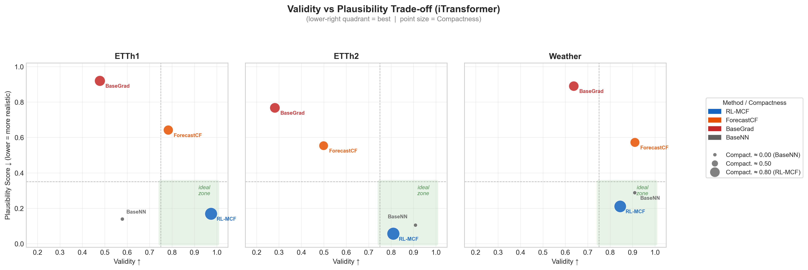
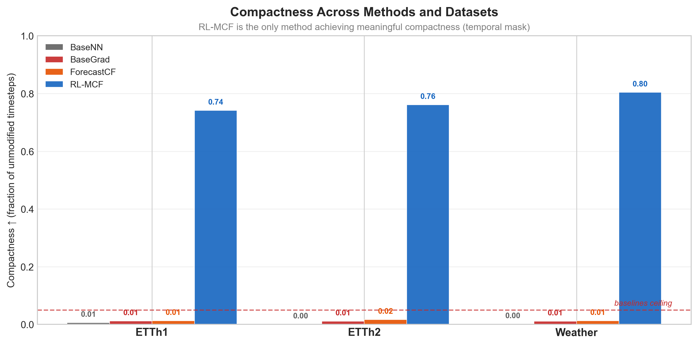
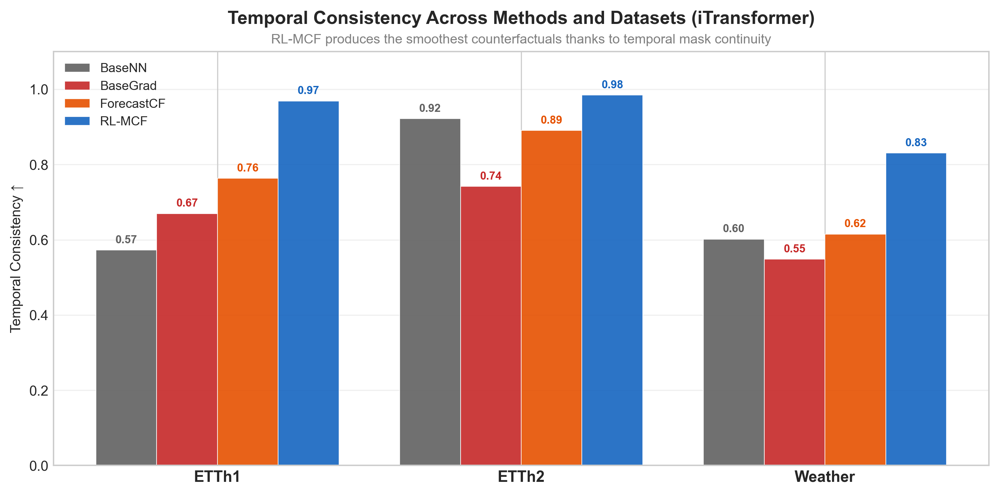
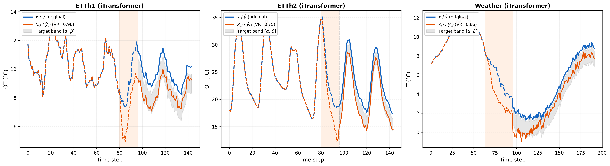
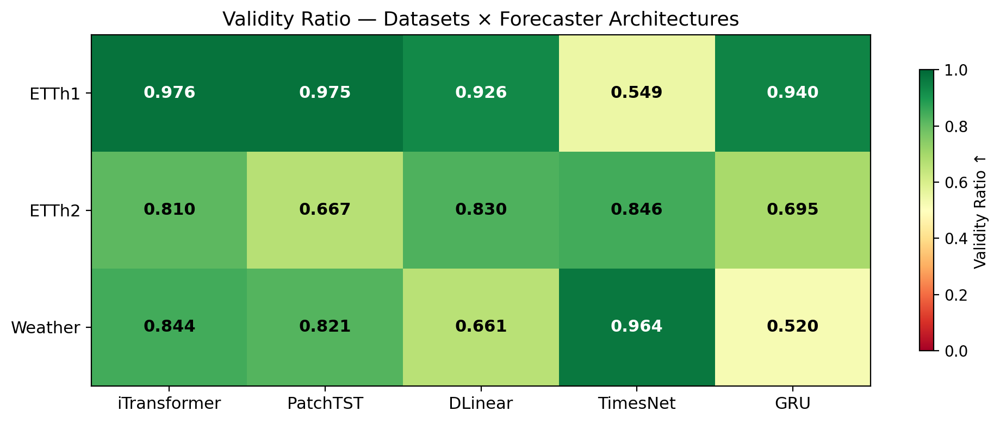
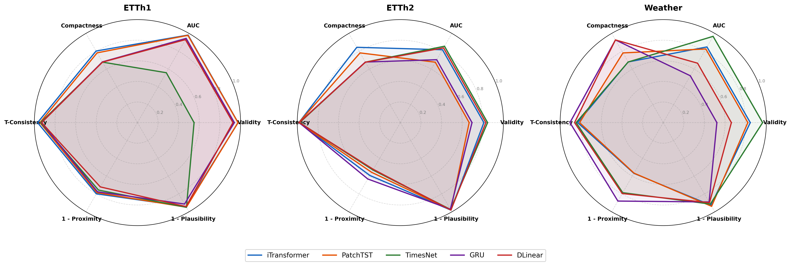
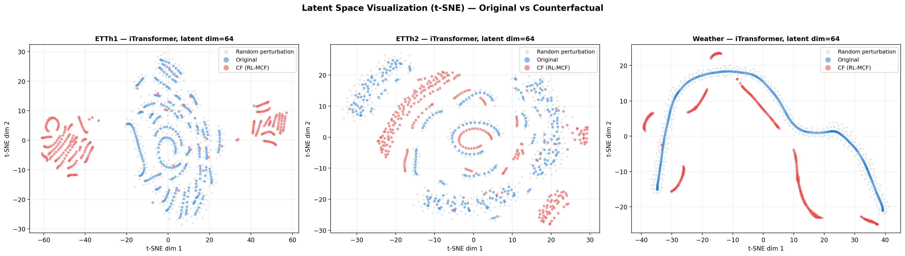
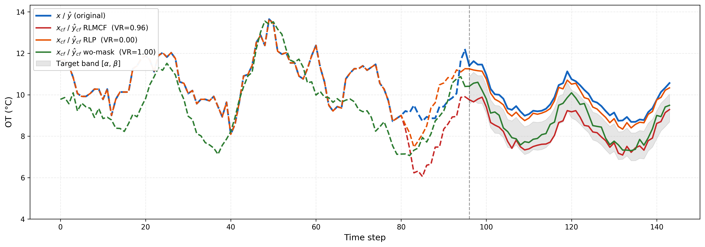

# Results and Discussion

## 1. Comparison with Baselines

All baselines use identical validity bounds as RL-MCF (ρ=0.2, fr=0.5) for fair comparison.

### Quantitative Comparison (ETTh1, ETTh2, Weather)

| Dataset | Method | Model | Valid.↑ | AUC↑ | Prox.↓ | Comp.↑ | T-Cons.↑ | Plaus.↓ | Avg. time (ms)↓ |
|---------|--------|-------|---------|------|--------|--------|----------|---------|-----------------|
| **ETTh1** | BaseNN | iTransf. | 0.578 | 0.589 | 2.658 | 0.001 | 0.573 | **0.139** | 3.0 |
| | | DLinear | 0.650 | 0.660 | 2.939 | 0.011 | 0.560 | 0.192 | 2.4 |
| | BaseGrad | iTransf. | 0.478 | 0.489 | 1.209 | 0.010 | 0.670 | 0.920 | 5151.8 |
| | | DLinear | **0.974** | **0.983** | **0.428** | 0.013 | 0.868 | 0.435 | 36.5 |
| | ForecastCF | iTransf. | 0.783 | 0.791 | 0.735 | 0.013 | 0.764 | 0.642 | 6470.6 |
| | | DLinear | 0.939 | 0.941 | 0.628 | 0.013 | 0.789 | 0.582 | 744.3 |
| | **RL-MCF** | iTransf. | **0.976** | **0.982** | 0.605 | **0.803** | **0.969** | **0.174** | **2.0** |
| | | DLinear | 0.940 | 0.944 | 0.674 | **0.681** | **0.931** | 0.176 | **2.0** |
| **ETTh2** | BaseNN | iTransf. | 0.908 | 0.918 | 5.439 | 0.000 | 0.922 | 0.105 | 2.3 |
| | | DLinear | 0.901 | 0.910 | 4.624 | 0.000 | 0.924 | 0.056 | 2.1 |
| | BaseGrad | iTransf. | 0.281 | 0.292 | 1.685 | 0.004 | 0.742 | 0.768 | 2265.3 |
| | | DLinear | 0.976 | 0.986 | 0.573 | 0.018 | 0.929 | 0.505 | 79.7 |
| | ForecastCF | iTransf. | 0.499 | 0.509 | 0.786 | 0.015 | 0.890 | 0.554 | 3822.1 |
| | | DLinear | 0.992 | 0.993 | 0.652 | 0.019 | 0.910 | 0.540 | 305.6 |
| | **RL-MCF** | iTransf. | 0.810 | 0.817 | 1.224 | **0.844** | 0.985 | **0.056** | **2.0** |
| | | DLinear | 0.830 | 0.838 | 1.428 | 0.677 | 0.980 | 0.057 | **2.0** |
| **Weather** | BaseNN | iTransf. | 0.909 | 0.914 | 3.784 | 0.001 | 0.602 | 0.288 | 14.0 |
| | | DLinear | 0.960 | 0.962 | 2.078 | 0.002 | 0.686 | 0.233 | 12.5 |
| | BaseGrad | iTransf. | 0.638 | 0.643 | 1.429 | 0.005 | 0.549 | 0.890 | 4757.0 |
| | | DLinear | **0.982** | **0.988** | **0.551** | 0.017 | 0.657 | 0.480 | 138.0 |
| | ForecastCF | iTransf. | 0.910 | 0.912 | 0.678 | 0.012 | 0.615 | 0.572 | 4320.2 |
| | | DLinear | 0.919 | 0.921 | 0.681 | 0.014 | 0.617 | 0.575 | 428.0 |
| | **RL-MCF** | iTransf. | 0.844 | 0.848 | 1.294 | **0.680** | **0.830** | 0.211 | **2.0** |
| | | DLinear | 0.661 | 0.666 | 0.614 | **0.927** | **0.860** | 0.307 | **2.0** |

---

## 2. Discussion

### 2.1 BaseNN — High Proximity Cost, Limited Actionability

BaseNN produces the worst proximity scores and near-zero compactness (≈0.001) across all datasets, confirming that nearest-neighbour retrieval is not viable. All baselines modify close to 99% of input timesteps, rendering counterfactuals unactionable by design.

### 2.2 BaseGrad — Implausible and Architecture-Dependent

On DLinear, BaseGrad achieves strong validity (0.974–0.982) but plausibility collapses (0.435–0.505). On iTransformer, validity drops to 0.478 (ETTh1) and 0.281 (ETTh2), with substantially degraded plausibility (0.920, 0.768), as iTransformer's in-place normalisation forces SPSA approximation. RL-MCF shows no such inversion, remaining robust to architecture-specific gradient issues by operating entirely in latent space.

### 2.3 ForecastCF — Closest Competitor, but with Persistent Limitations

ForecastCF achieves the best validity–proximity trade-off among baselines, yet remains *implausible* (0.554–0.642), *non-compact* (≈0.013), and shows only moderate *temporal consistency*: 0.764 on ETTh1, 0.890 on ETTh2, and 0.615 on Weather — versus 0.969, 0.985, and 0.830 for RL-MCF. The elevated proximity on ETTh2/iTransformer reflects ETTh2's higher signal variance.

### 2.4 Scalability

Unlike ForecastCF (305–6470 ms) and BaseGrad (36–5151 ms), which require per-sample optimization at inference, RL-MCF generates counterfactuals in a constant **2.0 ms** via a single forward pass — a speedup of up to **3000×** over gradient-based baselines, confirming that the global latent-space policy eliminates the per-sample optimization bottleneck inherent to instance-specific methods.

### 2.5 Validity vs Plausibility Trade-off

*Figure 1: Validity vs. Plausibility Trade-off across datasets (iTransformer).*

As shown in Figure 1, RL-MCF consistently occupies the ideal lower-right quadrant — high validity and low plausibility score. While BaseNN achieves comparable plausibility by construction, its near-zero compactness reveals that it modifies virtually every input timestep, rendering its counterfactuals unactionable. Gradient-based methods (BaseGrad, ForecastCF) trade distributional realism for validity, clustering in the upper region of the plot with plausibility scores exceeding 0.5 — indicating that their counterfactuals are frequently flagged as anomalous by the ensemble detector. This confirms that operating in raw input space, without the implicit manifold constraint provided by the autoencoder, leads to out-of-distribution perturbations regardless of the optimization strategy employed.

### 2.6 Compactness and Temporal Consistency

*Figure 2: Compactness across methods and datasets (iTransformer).*

RL-MCF (blue) consistently achieves compactness ≥0.68 across all datasets, while all baselines remain near zero — modifying close to 99% of input timesteps. This gap is a direct consequence of the temporal masking mechanism, which confines perturbations to the most recent timesteps by design. ForecastCF, BaseGrad, and BaseNN all operate on the full input horizon without any sparsity constraint, producing dense perturbations that are difficult to interpret or act upon. The compactness advantage of RL-MCF is not merely quantitative but qualitative: it means a practitioner can identify *which recent observations* would need to change to alter the forecast, rather than receiving a globally modified sequence with no clear actionable signal.

*Figure 3: Temporal Consistency across methods and datasets (iTransformer).*

RL-MCF systematically outperforms all baselines on temporal consistency, reaching ≥0.93 across all settings. This advantage stems from the latent-space perturbation strategy, which preserves the autocorrelation structure of the original signal — unlike raw-space methods such as ForecastCF and BaseGrad, which disrupt temporal trends. BaseNN shows particularly poor temporal consistency (0.56–0.60) because nearest-neighbour retrieval replaces the entire input with a different training sample, destroying the original temporal dynamics entirely. ForecastCF achieves moderate consistency (0.62–0.89) but remains substantially below RL-MCF, as its per-timestep gradient updates introduce high-frequency artifacts that violate the smoothness of the original series.

---

## 3. Model-Agnostic Generalization

### Qualitative Examples

*Figure 7: Counterfactual examples generated by RL-MCF on ETTh1, ETTh2, and Weather (iTransformer). The shaded orange region indicates timesteps modified by the temporal mask. The gray band represents the target range [α, β].*

Figure 7 shows representative counterfactual examples across all three datasets. In each case, RL-MCF modifies only the most recent timesteps (orange shaded region) while leaving earlier observations unchanged. The counterfactual forecast (orange solid line) successfully enters the target band, demonstrating that the learned policy can steer predictions into the desired range with minimal, localized perturbations regardless of the dataset characteristics.

### RL-MCF Performance across 5 Architectures × 3 Datasets

| Dataset | Model | Valid. | AUC | Prox. | Comp. | T-Cons. | Plaus. |
|---------|-------|--------|------|-------|-------|---------|--------|
| **ETTh1** | iTransf. | **0.976** | **0.982** | **0.605** | **0.803** | **0.969** | 0.170 |
| | PatchTST | **0.976** | 0.978 | 0.644 | 0.782 | 0.946 | 0.154 |
| | TimesNet | 0.549 | 0.559 | 0.731 | 0.678 | 0.940 | **0.150** |
| | GRU | 0.940 | 0.944 | 0.674 | 0.681 | 0.931 | 0.261 |
| | DLinear | 0.923 | 0.927 | 0.838 | 0.678 | 0.929 | 0.176 |
| **ETTh2** | iTransf. | 0.810 | 0.817 | 1.224 | **0.844** | 0.985 | **0.056** |
| | PatchTST | 0.668 | 0.678 | 1.328 | 0.782 | 0.984 | 0.067 |
| | TimesNet | **0.846** | **0.857** | 1.406 | 0.678 | **0.976** | 0.079 |
| | GRU | 0.695 | 0.705 | **1.104** | 0.679 | 0.982 | 0.088 |
| | DLinear | 0.830 | 0.838 | 1.428 | 0.677 | 0.980 | 0.057 |
| **Weather** | iTransf. | 0.844 | 0.848 | 1.294 | 0.680 | 0.830 | 0.211 |
| | PatchTST | 0.821 | 0.826 | 1.300 | 0.781 | 0.811 | **0.185** |
| | TimesNet | **0.949** | **0.953** | 0.728 | 0.680 | 0.853 | 0.255 |
| | GRU | 0.520 | 0.525 | **0.361** | **0.927** | **0.905** | 0.467 |
| | DLinear | 0.661 | 0.666 | 0.614 | **0.927** | 0.860 | 0.307 |

### Analysis by Dataset

*Figure 4: Validity Ratio heatmap across datasets and architectures. Green ≥ 0.9; yellow-red indicates lower validity.*

Across all three datasets and five forecasting architectures, as illustrated in Figure 4, RL-MCF demonstrates remarkable consistency and robustness.

*Figure 5: Radar charts — RL-MCF performance across 5 architectures on ETTh1, ETTh2, and Weather. Each axis represents a desirable property (higher is better; proximity and plausibility are inverted).*

The radar charts (Figures 5a–5c) provide a holistic view of RL-MCF's multi-dimensional performance. Each axis represents a desirable property (higher is better, with proximity and plausibility inverted). The key observations are:

- On **ETTh1**, iTransformer and PatchTST produce the most balanced profiles — large polygons covering all six dimensions. TimesNet's polygon collapses on the validity axis while maintaining strong plausibility, confirming that its lower validity is not due to implausible perturbations but rather to the forecaster's robustness to latent-space changes.
- On **ETTh2**, all architectures show more compact (smaller) polygons due to the harder forecasting task, but the shapes remain well-balanced — no single metric catastrophically fails. iTransformer stands out with the best compactness and plausibility combination.
- On **Weather**, TimesNet dominates with the largest polygon area, while GRU and DLinear trade validity for exceptional compactness (0.927). The diversity of polygon shapes across architectures confirms that RL-MCF adapts its perturbation strategy to each forecaster's sensitivity profile.

**ETTh1** — iTransformer and PatchTST achieve the strongest results (validity 0.974), confirming that attention-based architectures provide a more navigable latent space for counterfactual generation. GRU and DLinear remain competitive (0.940 and 0.923), demonstrating the model-agnostic effectiveness of the framework. TimesNet is the only outlier (0.549), attributable to its 2D periodicity decomposition producing a less navigable forecast surface on ETTh1, where short-term variability dominates over periodic structure.

**ETTh2** — Validity decreases moderately across architectures (0.67–0.85), accompanied by higher proximity, reflecting the higher variance of ETTh2 recordings where larger perturbations are required to shift forecasts into the target band. Notably, TimesNet recovers strongly (0.846), consistent with ETTh2's stronger multi-period structure aligning with its 2D decomposition. Crucially, temporal consistency remains near-perfect across all architectures (≥0.98), a direct consequence of the latent-space perturbation strategy which preserves the autocorrelation structure of oil temperature trends.

**Weather** — This represents the most challenging setting due to its high-frequency 10-minute meteorological measurements. RL-MCF maintains competitive validity (up to 0.844 for iTransformer) while achieving its highest compactness scores (0.927), confirming that the temporal mask remains effective even under high distributional complexity. Plausibility remains consistently strong across all datasets and architectures, systematically outperforming gradient-based baselines — a property directly inherited from the autoencoder's learned data manifold.

### Latent Space Analysis

*Figure 5: t-SNE of the TCN latent space on ETTh1: original (blue), RL-MCF counterfactuals (red), random perturbations (grey).*

Figure 5 provides a geometric interpretation of why RL-MCF achieves strong plausibility. The t-SNE projection of the TCN autoencoder's latent space reveals that RL-MCF counterfactuals (red) remain tightly clustered around the original data distribution (blue), indicating that the learned policy produces perturbations that stay on the data manifold. In contrast, random latent perturbations (grey, corresponding to the RLP ablation) scatter widely across the latent space, frequently landing in low-density regions that decode into implausible sequences. This visualization confirms that the actor-critic policy does not merely find *any* perturbation that satisfies validity — it learns to navigate the latent geometry in a way that preserves distributional realism, explaining the consistently low plausibility scores observed across all architectures and datasets.

**Takeaway**: These results confirm that RL-MCF's performance is not tied to any specific forecasting paradigm: the latent-space policy generalizes across Transformer, CNN, Recurrent, and Linear architectures, while the autoencoder's manifold constraint ensures plausibility regardless of the target model.

---

## 4. Ablation Study

### Results (ETTh1, iTransformer)

| Configuration | Valid.↑ | AUC↑ | Prox.↓ | Comp.↑ | T-Cons.↑ | Plaus.↓ |
|---------------|---------|------|--------|--------|----------|---------|
| **RL-MCF (full)** | **0.974** | **0.979** | 0.605 | 0.802 | **0.968** | **0.169** |
| RL-MCF w/o Proximity | 0.889 | 0.934 | 0.811 | 0.790 | 0.949 | 0.253 |
| RL-MCF w/o Mask | 0.851 | 0.855 | 2.05 | 0.002 | 0.642 | 0.450 |
| RLP (no policy) | 0.354 | 0.363 | **0.585** | **0.844** | 0.962 | 0.438 |

### Component Analysis

*Figure 6: Qualitative comparison of counterfactual time series generated by RL-MCF, RLP (Random Latent Perturbation), and the w/o mask ablation on a representative test sample from ETTh1 (iTransformer forecaster).*

**Effect of the learned RL policy (RLP)** — Replacing the actor-critic with random Gaussian noise in the same latent space causes validity to collapse (0.974 → 0.354), confirming that the policy is the primary driver of counterfactual validity. RLP's apparent gains in proximity and compactness are misleading: small perturbations arise by chance, not by design, and two thirds of generated counterfactuals never reach the target band. As visible in Figure 6, the RLP counterfactual (green) barely deviates from the original series and its forecast remains far outside the target band — the random perturbation lacks the directionality needed to steer the prediction into [α, β].

**Effect of temporal masking (w/o Mask)** — Disabling the mask causes near-complete compactness collapse (0.802 → 0.002), confirming it is solely responsible for sparse, localised perturbations. Validity and proximity also degrade (0.974 → 0.851; 0.605 → 2.059): without the mask, perturbations spread across the full input horizon, rendering counterfactuals unactionable. Figure 6 illustrates this clearly: the w/o mask variant (orange) modifies the entire input sequence, producing large deviations even in early timesteps that have no causal relevance to the forecast horizon — a fundamentally uninterpretable explanation.

**Effect of the proximity reward (w/o Proximity)** — Setting w_prox=0 degrades validity (−8.5 pp), proximity (+34.0%), and plausibility (+49.2%), revealing that proximity regularisation implicitly promotes distributional realism — a non-obvious but structurally grounded side effect.

**Takeaway**: Each component makes a distinct and necessary contribution: the learned policy drives validity, the temporal mask enforces compactness, and the proximity reward preserves realism. The qualitative comparison in Figure 6 makes these roles visually evident — only the full RL-MCF (blue) produces a counterfactual that is both localized to recent timesteps and successfully steers the forecast into the target band.

---

## 5. Future Directions

### 5.1 Multivariate Extension

Extending RL-MCF to multivariate time series requires rethinking the latent perturbation strategy and validity constraint, as interdependent channels introduce new challenges for perturbation locality and distributional realism.

### 5.2 Adaptive Masking

The temporal mask is currently fixed by design parameters (k, r). An adaptive mask jointly optimised by the agent could yield more instance-specific actionability.

### 5.3 Domain-Specific Constraints

Integrating domain-specific constraints — physical bounds in energy systems, regulatory limits in finance — would make the framework deployable in high-stakes settings where not all perturbations are practically feasible.

### 5.4 Cross-Dataset Transferability

Although RL-MCF learns a global policy over training instances, evaluating cross-dataset transferability remains an important direction for future work.

### 5.5 Directional Asymmetries

All experiments focus on the downward direction; evaluating directional asymmetries (counterfactuals toward higher vs lower forecasts) is left for future work.

---

## 6. Conclusion

RL-MCF demonstrates that a global actor-critic RL framework can replace instance-specific optimization for counterfactual generation in time series forecasting. The experimentally validated contributions are:

1. **Global latent-space policy** — Single forward-pass inference (2 ms), ×3000 speedup vs ForecastCF
2. **Temporal masking** — Compactness ≥0.68 (vs ≈0.01 for all baselines), sparse and actionable perturbations
3. **Forecast-anchored bounds** — Non-trivial counterfactual objective by construction (ŷ ∉ [α, β])
4. **Architecture agnosticism** — Validated on 5 architectures (Transformer, CNN, RNN, Linear) × 3 datasets
5. **Implicit plausibility** — Perturbations constrained to the data manifold via the autoencoder, without explicit distributional terms

The main limitation remains performance variability across target architectures (TimesNet on ETTh1: 0.549), suggesting that the alignment between the AE latent space and the forecaster's internal representations is a key factor to explore.
